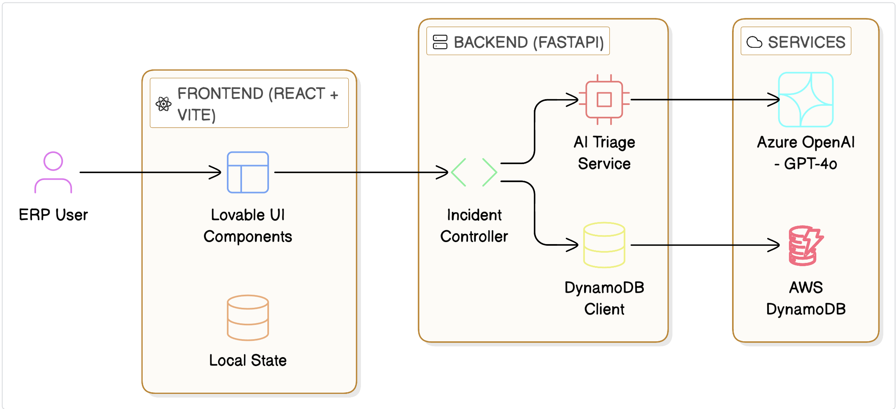
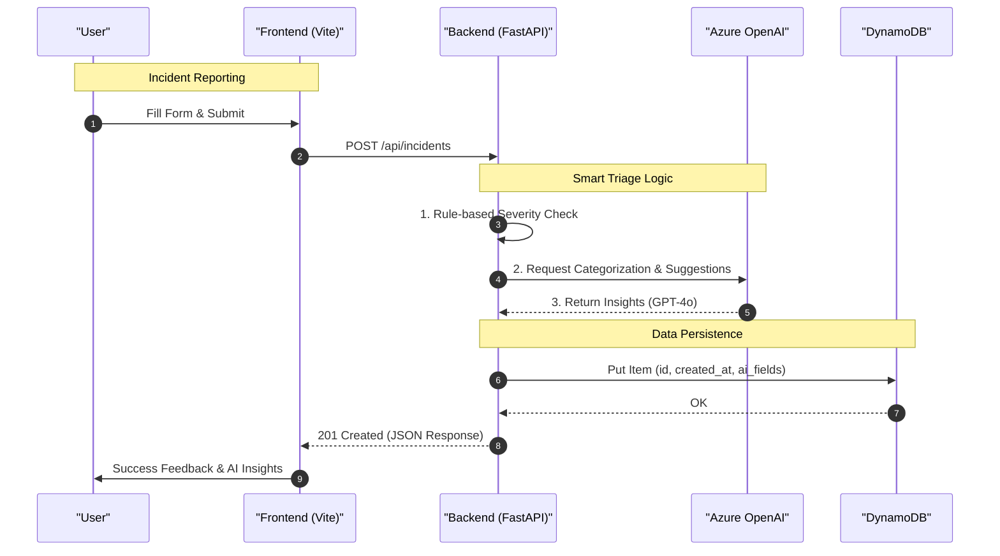
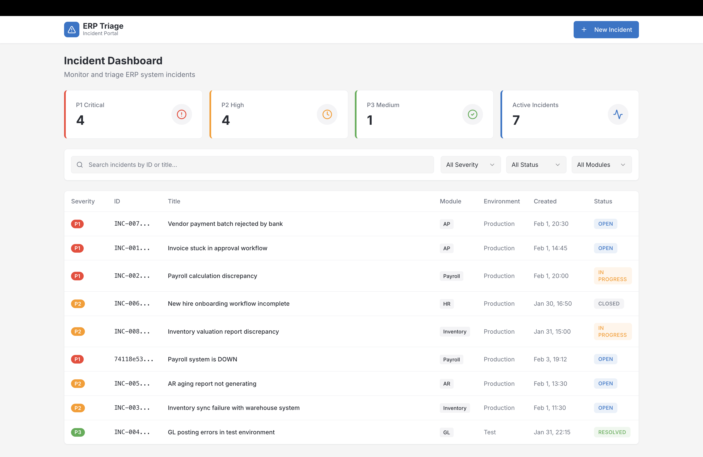
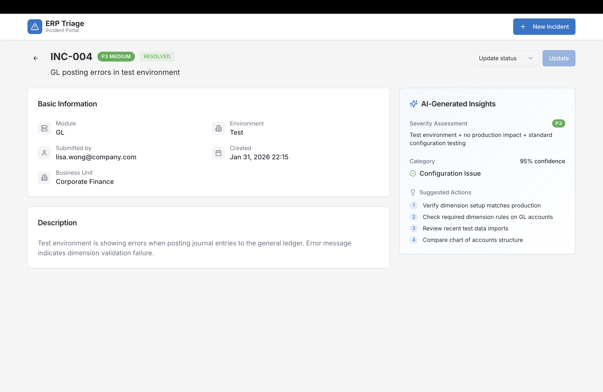
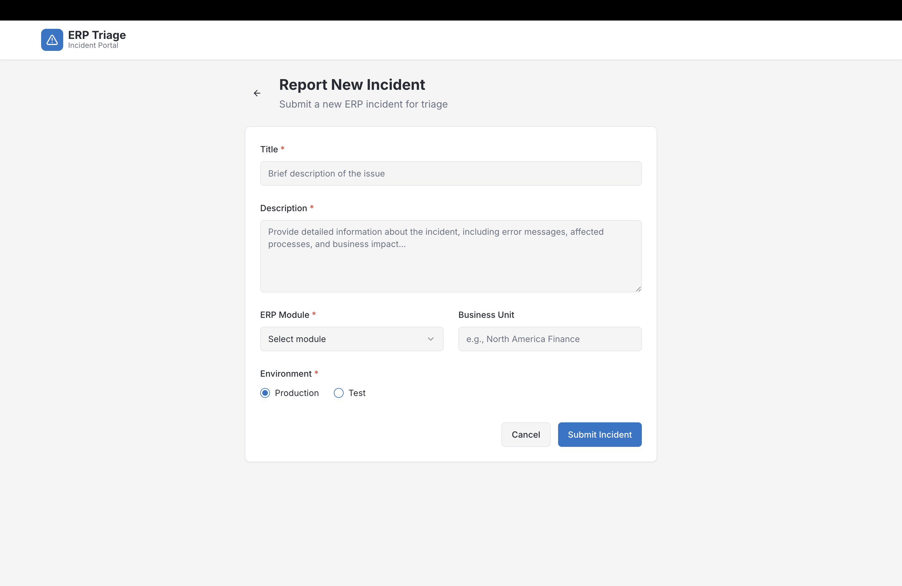

# Neuron: ERP Incident Triage System

Neuron is an AI-powered triage system that automates the categorization and prioritization of ERP incidents. It uses LLMs to analyze issue descriptions and provide immediate technical suggestions for support teams.

This project was built for the **NeuronERP** take-home assessment.

## 🚀 Architecture



## 📊 Data Flow



## 🗄 Database Schema (DynamoDB)

| Attribute | Type | Key | Description |
| :--- | :--- | :--- | :--- |
| **id** | `String` | **PK** | Unique identifier (UUID) |
| **title** | `String` | - | Incident title |
| **description** | `String` | - | Detailed problem description |
| **module** | `Enum` | - | ERP Module (AP, AR, GL, etc.) |
| **environment** | `Enum` | - | Production or Test |
| **status** | `Enum` | - | Current state (Open, In Progress, etc.) |
| **createdAt** | `String` | - | ISO timestamp |
| **aiSeverity** | `Enum` | - | AI priority level (P1-P3) |
| **aiCategory** | `Enum` | - | System-determined category |
| **aiConfidence** | `Number` | - | Confidence score (0-100) |
| **aiSuggestions**| `List` | - | Recommeded fix actions |

## 🛠 Tech Stack

*   **Frontend**: React (Vite) for the UI.
*   **Backend**: FastAPI for the REST API.
*   **Database**: AWS DynamoDB (Single-table design).
*   **AI**: Azure OpenAI (GPT-4o) for incident analysis.
*   **UI Components**: Shadcn/UI for consistent design.

## 🤖 Development Methodology

The project was developed iteratively using various AI agents under the supervision of a **Lead Developer**:

*   **Claude**: Used for initial planning and system architecture design.
*   **Lovable**: Used to build the frontend UI and ensure high visual standards.
*   **Antigravity**: Used as a coding assistant to implement backend logic, refactor the codebase into a modular `src/` structure, and integrate the API layers.
*   **Lead Developer**: Reviewed all code, managed architectural decisions, and directed the integration process to ensure technical standards were met.

## 🎬 Demo Video

[Watch the product walkthrough on Loom](https://www.loom.com/share/28809a48a5a943a592bc9aae3cbfff36)

*Note: This walkthrough was captured using the Antigravity autonomous browser-access feature, where an AI agent navigated the live application while the session was recorded.*

## 📸 Screenshots

### Dashboard


### Incident Detail


### New Incident


## 🔌 API Endpoints

*   `GET /api/incidents/`: List all incidents.
*   `POST /api/incidents/`: Create and analyze a new incident.
*   `GET /api/incidents/{id}`: Get single incident details.
*   `PATCH /api/incidents/{id}`: Update incident status.

## 📦 Running Locally

### Backend
1.  Navigate to `/backend`.
2.  Create & Activate the virtual environment
    `python -m venv venv`
    `source venv/bin/activate`
3.  Install requirements: `pip install -r requirements.txt`.
4.  Set environment variables in `.env`.
5.  Run: `uvicorn src.main:app --reload`.

### Frontend
1.  Navigate to `/frontend`.
2.  Run: `npm install && npm run dev`.

## ☁️ Deployment

### Docker
The project includes a `docker-compose.yml` to run the full stack:
```bash
docker-compose up -d --build
```

### EC2
1.  Launch an EC2 instance and install Docker.
2.  Clone the repo and configure environment variables.
3.  Run `docker-compose up -d`.
