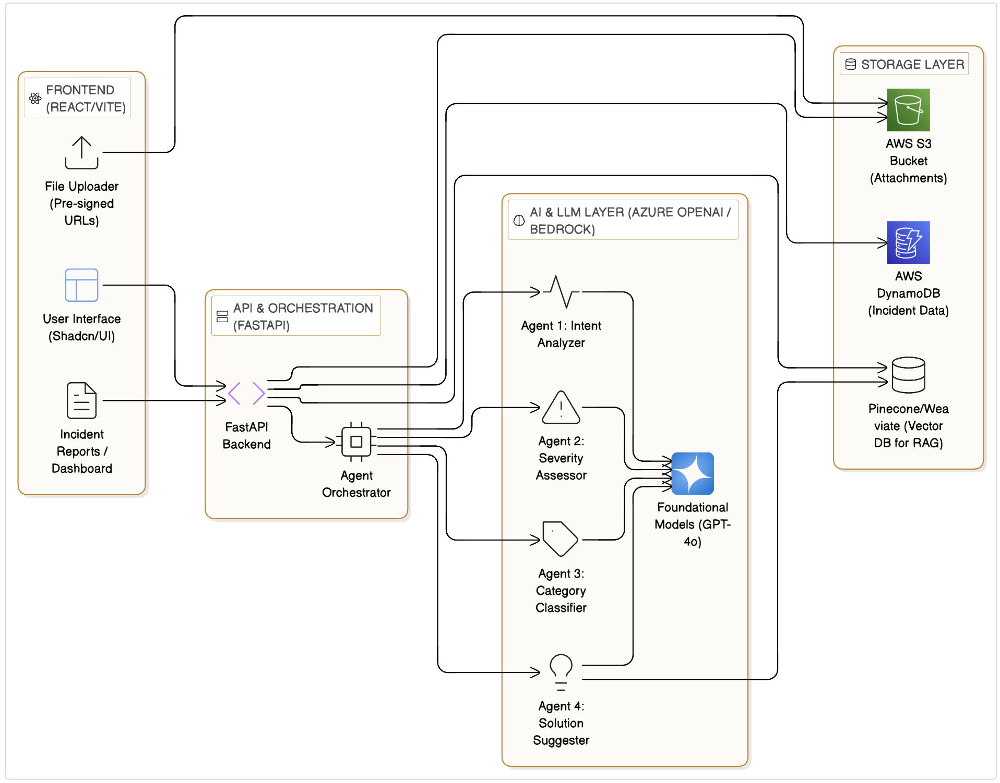

# System Architecture (HLD)

This document outlines the overall architecture of the ERP Incident Triage Portal, integrating the initial v1 components with the new Phase 2 intelligent features.

## High-Level Architecture Diagram



## Component Breakdown

### 1. Frontend (React/Vite)
- **User Interface**: Modern, responsive UI built with Shadcn/UI for consistent aesthetics.
- **Incident Intake**: Multi-step forms including a conversational interface for AI follow-ups.
- **File Upload**: Direct-to-S3 uploads using pre-signed URLs to reduce backend load.

### 2. Backend (FastAPI)
- **REST API**: Handles all CRUD operations for incidents and system settings.
- **Agent Orchestrator**: Manages the parallel execution and result merging of specialized AI agents.
- **Storage Integration**: Connects with DynamoDB for structured data and S3 for object storage.

### 3. AI & LLM Layer
- **Foundational Models**: Uses GPT-4o (via Azure OpenAI) for heavy reasoning and natural language processing.
- **Specialized Agents**:
    - **Intent Analyzer**: Generates follow-up questions for incomplete reports.
    - **Severity Assessor**: Evaluates business impact and assigns priority (P1-P3).
    - **Category Classifier**: Routes incidents to the correct functional teams.
    - **Solution Suggester**: Provides actionable steps using RAG.

### 4. Data & Memory
- **DynamoDB**: Primary database for incident metadata, audit logs, and user roles.
- **AWS S3**: Secure storage for user-uploaded screenshots, logs, and technical documents.
- **Vector Database (RAG)**: Stores embeddings of past incidents and resolution patterns for intelligent suggestions.


# ERP Incident Triage Portal - Implementation Plan

## What We're Building

An intelligent incident management system with AI-powered conversational intake to ensure complete, high-quality incident reports.

---

## Phase 2: Conversational Incident Intake (Primary Focus)

### 2.1 Initial Incident Form
When user clicks "Create New Incident", they see:

**Static Form Fields (Always Present):**
- **Title*** - Brief description of the issue
- **Description*** - Detailed information about the incident
- **ERP Module*** - Dropdown (AP, AR, GL, Inventory, HR, Payroll)
- **Business Unit** - Text input (optional)
- **Environment*** - Radio buttons (Production / Test)
- **Attachments** - File upload (screenshots, logs, documents)

**Submit Button Behavior:**
- User clicks "Submit Incident"
- Show loading: "AI is analyzing your incident..."
- AI analyzes in background

### 2.2 AI Analysis Decision Tree

**Scenario A: Information is Complete**
```
AI determines: "Sufficient information provided"
→ Create incident immediately
→ Show success message with incident ID (INC-001)
→ Display AI-generated insights (severity, category, suggestions)
→ Option to: View Detail | Go to Dashboard
```

**Scenario B: Information is Incomplete**
```
AI determines: "Need additional details"
→ DO NOT create incident yet
→ Show follow-up questions modal/page
→ Display alert: "Please answer a few more questions before we create your incident"
```

### 2.3 Follow-Up Questions Flow

**UI Layout:**
```
┌─────────────────────────────────────────────────────────┐
│  🤖 ERP Incident Assistant                              │
│  We need a bit more information to help you effectively │
├─────────────────────────────────────────────────────────┤
│                                                          │
│  Question 1 of 4                                        │
│                                                          │
│  Which environment are you working in?                  │
│  ○ Production                                           │
│  ○ Test                                                 │
│                                                          │
│                            [← Back]  [Next]  [Skip All]│
└─────────────────────────────────────────────────────────┘
```

**Supported Question Types:**
- Multiple choice (radio buttons)
- Checkboxes (multi-select)
- Text input (short answer)
- Text area (long answer)
- Dropdown
- Date picker

**Question Categories AI Can Ask:**
1. **Technical Details**
   - Exact error message
   - Which step/screen the issue occurs
   - Specific functionality affected

2. **Context Information**
   - Transaction IDs (invoice #, PO #, etc.)
   - User accounts affected
   - Date/time when issue started

3. **Business Impact** (Dynamic, if not clear from initial description)
   - Urgency level
   - Blocked processes (month-end close, payroll, etc.)
   - Number of users affected
   - Customer/vendor impact

**User Options:**
- Answer questions one by one
- Go back to edit previous answers
- **Skip All** - Submit incident with current information
- Close and return to form to add more details initially

### 2.4 Business Impact Assessment (Conditional)

If AI cannot determine business impact from initial description and follow-ups:

```
┌─────────────────────────────────────────────────────────┐
│  🤖 ERP Incident Assistant                              │
│  Help us prioritize your incident appropriately        │
├─────────────────────────────────────────────────────────┤
│                                                          │
│  How urgently does this need to be resolved?            │
│  ○ Critical - Business process completely blocked       │
│  ○ High - Workaround exists but inefficient            │
│  ○ Medium - Causing delays but not blocking work       │
│  ○ Low - Minor inconvenience                           │
│                                                          │
│  Is this blocking any critical business activities?     │
│  ☐ Month-end close                                      │
│  ☐ Payroll processing                                   │
│  ☐ Customer shipments                                   │
│  ☐ Regulatory reporting                                 │
│  ☐ None of the above                                    │
│                                                          │
│  How many users are affected?                           │
│  ○ Just me                                              │
│  ○ My team (5-10 users)                                │
│  ○ Department (50+ users)                              │
│  ○ Entire company                                       │
│                                                          │
│                            [← Back]  [Next]  [Skip]    │
└─────────────────────────────────────────────────────────┘
```

### 2.5 Confirmation & Summary

After all questions (or if user skips):

```
┌─────────────────────────────────────────────────────────┐
│  🤖 ERP Incident Assistant                              │
│  Please review before submitting                        │
├─────────────────────────────────────────────────────────┤
│                                                          │
│  📋 Incident Summary                                    │
│                                                          │
│  Title: Invoice stuck in approval workflow             │
│  Module: Accounts Payable (AP)                         │
│  Environment: Production                                │
│  Business Unit: North America Finance                  │
│                                                          │
│  Issue Description:                                     │
│  Invoice INV-12345 ($50K) is stuck in approval         │
│  workflow. Error: "Approval hierarchy not defined      │
│  for amount > $10K"                                    │
│                                                          │
│  ─────────────────────────────────────────             │
│                                                          │
│  🤖 AI Analysis                                         │
│                                                          │
│  🔴 Severity: P1 - Critical                            │
│  Reason: Production environment + blocking month-end   │
│  close + affects 50+ users                             │
│                                                          │
│  🏷️ Category: Configuration Issue                      │
│  Subcategory: Approval Workflow                        │
│  Confidence: 88%                                        │
│                                                          │
│  💡 Suggested Next Steps:                              │
│  1. Verify approval hierarchy setup for $10K+ amounts  │
│  2. Check if temporary approver can be assigned        │
│  3. Review 3 similar resolved incidents                │
│                                                          │
│  Attachments: screenshot.png (1.2 MB)                  │
│                                                          │
│                                                          │
│              [← Edit]  [Confirm & Submit Incident]     │
└─────────────────────────────────────────────────────────┘
```

**After Confirmation:**
- Create incident in database
- Generate incident ID (INC-001)
- Show success modal:
  ```
  ✅ Incident INC-001 Created Successfully
  
  Your incident has been submitted and assigned P1 priority.
  You can track its progress in the dashboard.
  
  [View Incident Details]  [Go to Dashboard]
  ```

### 2.6 File Attachments

**Upload Flow:**
1. User selects file(s) from initial form
2. Frontend requests pre-signed URL from backend
   - `POST /api/upload/request-url`
   - Returns: `{uploadUrl, fileKey}`
3. Frontend uploads file directly to S3 using pre-signed URL
4. File stored in S3 with structure:
   ```
   s3://bucket-name/
     └── incidents/
         └── {incidentId}/
             └── attachments/
                 └── {timestamp}_{filename}
   ```
5. When incident created, backend stores file references:
   ```json
   {
     "attachments": [
       {
         "fileKey": "incidents/INC-001/attachments/1675234567_screenshot.png",
         "fileName": "screenshot.png",
         "fileSize": 1258291,
         "contentType": "image/png",
         "uploadedAt": "2026-02-01T09:15:00Z",
         "uploadedBy": "user@email.com"
       }
     ]
   }
   ```

**File Restrictions:**
- Max file size: 10 MB per file
- Max files: 5 per incident
- Allowed types: .png, .jpg, .pdf, .xlsx, .docx, .txt, .log
- Virus scanning on upload (AWS S3 + ClamAV Lambda)

---

# AI Backend Agents - Implementation Guide

## Overview

Four specialized AI agents working together to provide intelligent incident triage and enrichment.

---

## Agent 1: Intent Analyzer & Question Generator

### Purpose
Analyzes initial incident description to determine if more information is needed and generates contextual follow-up questions.

### Input
```json
{
  "title": "Invoice stuck in approval",
  "description": "I can't process an invoice",
  "module": "AP",
  "environment": "Production",
  "businessUnit": "North America Finance"
}
```

### Processing Logic
1. Analyze description completeness
2. Identify issue type (Error, Stuck Process, Access Issue, Performance)
3. Detect missing critical information:
   - Exact error message
   - Specific step/screen
   - Transaction identifiers (invoice #, amount)
   - Business impact details
4. Generate 3-5 targeted questions based on gaps

### Output
```json
{
  "needsMoreInfo": true,
  "confidence": 0.75,
  "identifiedIssueType": "Stuck Process",
  "missingInformation": ["error_message", "specific_step", "business_impact"],
  "questions": [
    {
      "id": "q1",
      "question": "What exactly happens when you try to process the invoice?",
      "type": "multiple_choice",
      "options": [
        "System shows an error message",
        "Invoice is stuck in a specific step",
        "Button/option is grayed out",
        "System is slow or frozen"
      ],
      "required": false
    },
    {
      "id": "q2",
      "question": "Do you see any error message? If yes, please copy it here:",
      "type": "text_area",
      "placeholder": "Paste exact error message...",
      "required": false
    },
    {
      "id": "q3",
      "question": "What is the invoice number and amount?",
      "type": "text_input",
      "placeholder": "e.g., INV-12345, $50,000",
      "required": false
    }
  ]
}
```

### API Endpoint
```
POST /api/ai/analyze-incident
```

---

## Agent 2: Severity Assessor

### Purpose
Determines incident severity (P1/P2/P3) based on complete incident data including business impact.

### Input
```json
{
  "description": "Invoice INV-12345 for $50K stuck in approval workflow",
  "module": "AP",
  "environment": "Production",
  "errorMessage": "Approval hierarchy not defined for amount > $10K",
  "businessImpact": {
    "urgency": "Critical",
    "blockedProcesses": ["month-end-close"],
    "usersAffected": "department"
  },
  "questionsAnswered": [...]
}
```

### Assessment Criteria

**P1 (Critical) - Assigned if ANY:**
- Production completely down
- Business-critical process blocked (month/year-end close, payroll, regulatory reporting)
- Data integrity/security risk
- 50+ users unable to work
- Regulatory deadline at immediate risk

**P2 (High) - Assigned if ANY:**
- Production degraded but functional
- Important process delayed with difficult workaround
- 10-50 users significantly impacted
- Non-critical deadline at risk

**P3 (Medium/Low) - Assigned if ALL:**
- Test environment OR
- Minor inconvenience with easy workaround OR
- <10 users affected OR
- Enhancement request

### Output
```json
{
  "severity": "P1",
  "confidence": 0.95,
  "reasoning": "Production environment + blocking month-end close (regulatory deadline) + affects entire Finance department (50+ users)",
  "businessImpactScore": 95,
  "recommendedSLA": "Response: 1 hour, Resolution: 4 hours"
}
```

### API Endpoint
```
POST /api/ai/assess-severity
```

---

## Agent 3: Category Classifier

### Purpose
Classifies incident into specific category and subcategory for proper routing to support teams.

### Input
```json
{
  "description": "Invoice stuck in approval workflow",
  "module": "AP",
  "errorMessage": "Approval hierarchy not defined for amount > $10K",
  "userActions": "Tried to submit invoice for approval",
  "questionsAnswered": [...]
}
```

### Categories

1. **Configuration Issue**
   - Keywords: approval, workflow, hierarchy, rule, setup, validation
   - Subcategories: Approval Workflow, Validation Rules, Module Setup

2. **Data Issue**
   - Keywords: missing, incorrect, invalid, data, record not found
   - Subcategories: Master Data, Transaction Data, Data Migration

3. **Integration Failure**
   - Keywords: integration, API, interface, sync, EDI, connection
   - Subcategories: API Error, File Interface, System Sync

4. **Security/Access**
   - Keywords: access, permission, login, authenticate, role, unauthorized
   - Subcategories: User Permissions, Role Assignment, Authentication

5. **Performance**
   - Keywords: slow, timeout, freeze, hang, loading
   - Subcategories: Response Time, System Freeze, Resource Constraint

6. **Bug/Defect**
   - Keywords: bug, defect, error, crash, incorrect calculation
   - Subcategories: System Error, Calculation Error, Unexpected Behavior

### Output
```json
{
  "category": "Configuration Issue",
  "subcategory": "Approval Workflow",
  "confidence": 0.88,
  "reasoning": "Error message mentions 'approval hierarchy not defined' which indicates missing configuration. Common pattern for AP approval workflows.",
  "keywordsMatched": ["approval hierarchy", "amount limit", "workflow"],
  "recommendedTeam": "AP Functional Team"
}
```

### API Endpoint
```
POST /api/ai/categorize
```

---

## Agent 4: Solution Suggester

### Purpose
Generates actionable troubleshooting steps based on category, error patterns, and similar resolved incidents.

### Input
```json
{
  "category": "Configuration Issue",
  "subcategory": "Approval Workflow",
  "module": "AP",
  "errorMessage": "Approval hierarchy not defined for amount > $10K",
  "description": "Invoice INV-12345 ($50K) stuck in approval",
  "similarIncidents": [
    {
      "incidentId": "INC-042",
      "resolution": "Added missing approval rule for $10K+ threshold",
      "timeToResolve": 7200
    },
    {
      "incidentId": "INC-078",
      "resolution": "Assigned temporary approver",
      "timeToResolve": 1800
    }
  ]
}
```

### Generation Logic
1. Start with quickest validation steps (1-5 min)
2. Include common fixes from similar incidents
3. Provide specific navigation paths
4. End with escalation path if needed
5. Prioritize by: frequency of success, time to execute, skill required

### Output
```json
{
  "suggestions": [
    {
      "step": 1,
      "action": "Verify approval hierarchy configuration in AP module setup (Navigation: Setup > Financials > AP > Approval Rules). Check if approval limits are defined for amounts exceeding $10,000.",
      "expectedOutcome": "Approval rule should exist with proper amount thresholds and active approvers assigned",
      "estimatedTime": "5 minutes",
      "assignedTo": "AP Functional Team",
      "priority": "high",
      "successRate": 0.85
    },
    {
      "step": 2,
      "action": "Verify user John Smith has active role 'AP Invoice Approver' with approval limit >= $50,000 (Navigation: Setup > Users > Roles and Permissions).",
      "expectedOutcome": "User should have active approver role with sufficient limit",
      "estimatedTime": "3 minutes",
      "assignedTo": "Security Team",
      "priority": "high",
      "successRate": 0.75
    },
    {
      "step": 3,
      "action": "As temporary workaround, assign alternate approver with sufficient limit to unblock invoice while investigating root cause.",
      "expectedOutcome": "Invoice can proceed through approval workflow",
      "estimatedTime": "10 minutes",
      "assignedTo": "AP Functional Team",
      "priority": "medium",
      "successRate": 0.90
    },
    {
      "step": 4,
      "action": "Enable debug logging for approval workflow and reproduce the issue to capture detailed error logs.",
      "expectedOutcome": "Detailed error log showing exact point of failure",
      "estimatedTime": "15 minutes",
      "assignedTo": "Technical Team",
      "priority": "low",
      "successRate": 0.60
    },
    {
      "step": 5,
      "action": "If all above steps fail, escalate to Oracle Support. Reference similar case SR #12345678.",
      "expectedOutcome": "Oracle Support provides patch or configuration guidance",
      "estimatedTime": "Vendor dependent",
      "assignedTo": "Senior ERP Admin",
      "priority": "escalation",
      "successRate": 0.95
    }
  ],
  "estimatedTotalTime": "30-60 minutes for initial resolution, excluding vendor escalation",
  "similarIncidentPattern": "2 out of 3 similar incidents resolved by adjusting approval hierarchy configuration. Average resolution time: 45 minutes.",
  "autoResolutionPossible": false
}
```

### API Endpoint
```
POST /api/ai/suggest-solutions
```

---

## Agent Orchestration Flow

```
User Submits Initial Form
         ↓
┌─────────────────────┐
│  Agent 1: Intent    │
│  Analyzer           │ → Generates follow-up questions (if needed)
└─────────────────────┘
         ↓
User Answers Questions (or skips)
         ↓
┌─────────────────────────────────────────────────── ─┐
│  Parallel Execution (all 3 agents at once)          │
│                                                     │
│  ┌─────────────┐  ┌─────────────┐  ┌────────────┐   │
│  │  Agent 2:   │  │  Agent 3:   │  │Agent 4:    │   │
│  │  Severity   │  │  Category   │  │Solution    │   │
│  │  Assessor   │  │  Classifier │  │  Suggester │   │
│  └─────────────┘  └─────────────┘  └────────────┘   │
└─────────────────────────────────────────────────── ─┘
         ↓
Merge Results + Create Incident
         ↓
Show Confirmation with AI Insights
```

---